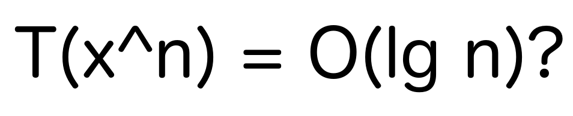

# Exponentiation by squaring



While solving one of the tasks at [InterviewBit](https://www.interviewbit.com) (I don't remember the exercise itself),
I saw a magical (and unknown to me) exponentiation method that worked in logarithmic time. 
When I threw away the magical part, the method was very exquisite and clear.

Here is the [code itself](https://github.com/YaroslavHavrylovych/dsa/blob/development/algorithms/math/exponentiation_by_squaring/java/Exponentiation.java). If everything is clear to you, then you can skip further reading:

```java
long pow(long val, long exp) {
    long res = 1;
    while(exp != 0) {
        if((exp & 1) == 1) res *= val;
        val *= val;
        exp >>= 1;
    }
    return res;
}
```

**The concrete problem's statement**: exponentiate `x` to `n`, where x=[1,2,3,...], n = [0,1,2,3,....]

Let's warm up the memory a little bit and start with the standard [linear time](https://en.wikipedia.org/wiki/Time_complexity#Linear_time) exponentiation procedure which follows the [definition](https://en.wikipedia.org/wiki/Exponentiation). Exempli gratia:

```
x^n=x*x*x*....*x (n разів)
```

We want to reduce the multiplications amount `x*x` because this is a continuously repeated operation.
To achieve this, we use an essential exponentiation's property:

```mathematica
x^(a+b)=(x^a)*(x^b).
```

Thus `n=a+b`, and we're searching for `a` which is somehow related to `b`. No more hints, we want `a=2*b`, where `x^a=x^b * x^b`.  

We can use the fact that any number can be written as the sum of powers of two since it is actually a number representation in the [binary number system](https://en.wikipedia.org/wiki/Binary_number). Let's take `177` as an example:

```mathematica
117=64+32+16+4+1=2^6+2^5+2^4+2^2+2^0. 
```

Denote by a factor of zero the missing powers of two:

```mathematica
117 = 1*2^6+1*2^5+1*2^4+0*2^3+1*2^2+0*2^1+1*2^0 = 1*e6+1*e5+1*e4+0*e3+1*e2+0*e1+1*e0,
e0=1 (2^0)
e1=2*e0 (2^1)
e2=2*e1 (2^2)
e3=2*e2 (2^3)
...
n[]=[1110101]
n[0]=1
n[1]=0
n[2]=1
...
```

Then:

```mathematica
x^117 = x^(n[6]*e6)*x^(n[5]*e5)*x^(n[4]*e4)*x^(n[3]*e3)*x^(n[2]*e2)*x^(n[1]*e1)*x^(n[0]*e0)
```

Summarize:

```mathematica
x^n = mult(x^(n[i]*ei)) 
...
i=0..log(n), ei=2^i
x^e(i+1) = x^ei*x^ei
```

**In a simple English**: to get `x^n`, it is sufficient to multiply all `x^(2^i)`  among themselves for which the bit value under `i` is equal to `1` (`i` is `i`'s digit of the binary representation of n). 

To calculate each next `x^(2^i)` value we have to keep in memory only the previous value: `x^(2^i) = x^(2^(i-1)) * x^(2^(i-1))`. Thus, we could significantly decrease the amount of needed operations. Using this method, we can perform `x^117` with the cost of eleven multiplication operations instead of 117 expected.

Let's gaze at the [code](https://github.com/YaroslavHavrylovych/dsa/blob/development/algorithms/math/exponentiation_by_squaring/java/Exponentiation.java) once again:

```java
long pow(long x, long n) {
    long res = 1; //the multiplication result 
    while(n != 0) {
        if((n & 1) == 1) res *= val; //x moves to the result
        x *= x; //x = x*x - for the next iteration
        n >>= 1; //division by 2 (achieved using the bit operation)
    }
    return res;
}
```

Of course, we could use any other base than 2,
but the convenience of binary is that numbers, in most programming languages,
have a free binary form and convenient binary API.