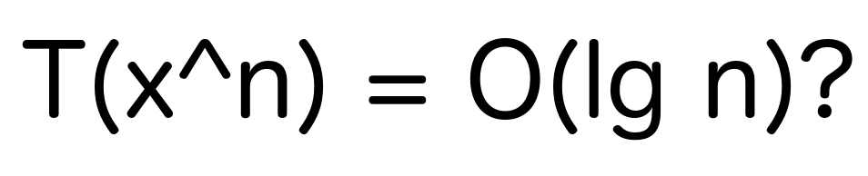

# Швидке піднесення до степеня



Розв'язуючи одну із задач на [InterviewBit](https://www.interviewbit.com) (шкода вже не пам'ятаю, яку саме),
я побачив магічний (і мені невідомий) метод піднесення до степеня, 
який працював не зовсім так як я очікував і містив пропорційну логарифмічній кількість арифметичних операцій. Якщо відкинути магічну частину, то метод є дуже елегантним і зрозумілим.

Одразу [код](https://github.com/YaroslavHavrylovych/dsa/blob/development/algorithms/math/exponentiation_by_squaring/java/Exponentiation.java). Якщо все зрозуміло, то далі можна і не читати:

```java
long pow(long val, long exp) {
    long res = 1;
    while(exp != 0) {
        if((exp & 1) == 1) res *= val;
        val *= val;
        exp >>= 1;
    }
    return res;
}
```

**Конкретизуємо задачу**: піднести `x` до степеня `n`, де x=[1,2,3,...], n = [0,1,2,3,....]

Трохи розігріємо пам'ять і почнемо з того, що процедура піднесення до степеня звичайним алгоритмом, який випливає із 
[визначення](https://uk.wikipedia.org/wiki/%D0%9F%D1%96%D0%B4%D0%BD%D0%B5%D1%81%D0%B5%D0%BD%D0%BD%D1%8F_%D0%B4%D0%BE_%D1%81%D1%82%D0%B5%D0%BF%D0%B5%D0%BD%D1%8F),
виконується за [лінійний час](https://uk.wikipedia.org/wiki/%D0%A7%D0%B0%D1%81%D0%BE%D0%B2%D0%B0_%D1%81%D0%BA%D0%BB%D0%B0%D0%B4%D0%BD%D1%96%D1%81%D1%82%D1%8C_%D0%B0%D0%BB%D0%B3%D0%BE%D1%80%D0%B8%D1%82%D0%BC%D1%83#%D0%9B%D1%96%D0%BD%D1%96%D0%B9%D0%BD%D0%B8%D0%B9_%D1%87%D0%B0%D1%81).
Тобто:

```
x^n = x*x*x*....*x (n разів)
```

Кількість цих множень `x*x` ми хочемо зменшити, оскільки це операція яка постійно повторюється.
Для цього використаємо одну із властивістей степеня:

```mathematica
x^(a+b) = (x^a) * (x^b).
```

Отже для `n=a+b`, ми шукаємо випадок, коли `a` якимось чином пов'язана із `b`. Не буду довго натякати, нас цікавить випадок, коли `a=2*b`, тоді `x^a = x^b * x^b`.

Використаємо те, що будь-яке число можна записати як суму степенів двійки, оскільки це фактично є записом числа у 
[двійковій системі числення](https://uk.wikipedia.org/wiki/%D0%94%D0%B2%D1%96%D0%B9%D0%BA%D0%BE%D0%B2%D0%B0_%D1%81%D0%B8%D1%81%D1%82%D0%B5%D0%BC%D0%B0_%D1%87%D0%B8%D1%81%D0%BB%D0%B5%D0%BD%D0%BD%D1%8F). Візьмемо число `177` за приклад:

```mathematica
117 = 64+32+16+4+1 = 2^6+2^5+2^4+2^2+2^0. 
```

Введемо у суму, із множником 0, степені двійки які відсутні в розкладанні числа:

```mathematica
117 = 1*2^6+1*2^5+1*2^4+0*2^3+1*2^2+0*2^1+1*2^0 = 1*e6+1*e5+1*e4+0*e3+1*e2+0*e1+1*e0,
e0=1 (2^0)
e1=2*e0 (2^1)
e2=2*e1 (2^2)
e3=2*e2 (2^3)
...
n[]=[1110101]
n[0]=1
n[1]=0
n[2]=1
...
```

Тоді:

```mathematica
x^117 = x^(n[6]*e6)*x^(n[5]*e5)*x^(n[4]*e4)*x^(n[3]*e3)*x^(n[2]*e2)*x^(n[1]*e1)*x^(n[0]*e0)
```

Узагальнимо:

```mathematica
x^n = mult(x^(n[i]*ei)) 
...
i=0..log(n), ei=2^i
x^e(i+1) = x^ei*x^ei
```

**Запишемо словами**: для того, щоб отримати `x^n` достатньо перемножити між собою усі `x^(2^i)`, для яких значення біту під `i` рівне `1`  ( `i` - номер розряду числа у двійковому записі числа `n`).

Для обрахунку наступного x^(2^i) нам потрібно тримати в пам'яті лише попереднє значення: `x^(2^i) = x^(2^(i-1)) * x^(2^(i-1))`. Такий підхід суттєво зменшує загальну кулькість необхідних оперцій. Для прикладу `x^117` ми можемо отримати, виконавши 11 операцій множення, замість 117, які планували із використанням звичайного алгоритму.

І ще раз глянемо на [код](https://github.com/YaroslavHavrylovych/dsa/blob/development/algorithms/math/exponentiation_by_squaring/java/Exponentiation.java):

```java
long pow(long x, long n) {
    long res = 1; //результат множення
    while(n != 0) {
        if((n & 1) == 1) res *= val; //x йде в результат
        x *= x; //x = x*x - для наступного розряду
        n >>= 1; //ділення на 2 методом побітового зсуву
    }
    return res;
}
```

П.С.

Звичайно, ми могли б використати будь-який інший формат запису замість двійкового,
але зручність двійкового в тому, що числа, у більшості мов програмування, 
мають безкоштовну двійкову форму запису і зручні методи роботи із нею.

П.П.С.

Для великих чисал чималу кількість часу займає саме операція множення, тому алгоритм працюватиме суттєво довше на [великих числах](https://uk.wikipedia.org/wiki/%D0%9C%D0%BD%D0%BE%D0%B6%D0%B5%D0%BD%D0%BD%D1%8F_%D0%9A%D0%B0%D1%80%D0%B0%D1%86%D1%83%D0%B1%D0%B8).